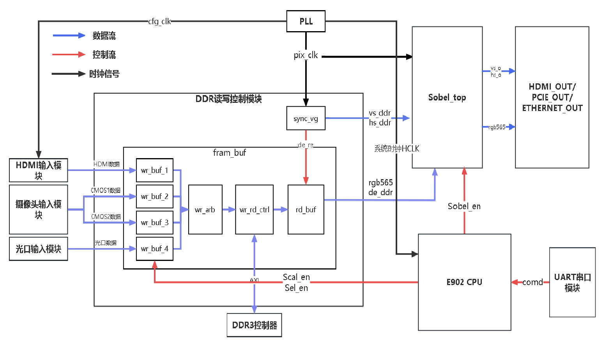

# ABSTRACT

&emsp;The aim of this project is to utilize the Pango PGL50H-6FBG484 FPGA development board by ZiGong TongChuang to implement multiple functionalities. 

&emsp;The FPGA board is used for video data capture from optical ports, cameras, and HDMI, allowing the system to receive different types of video sources. Next, DDR3 is utilized for video concatenation and buffering of four video sources, merging them into a single video stream for further processing and transmission. The concatenated video data is transferred to the PC via Ethernet and PCIe interfaces. 

&emsp;On the PC side, the project employs an AI recognition algorithm based on the YOLO v5 model to perform video object detection, enabling intelligent recognition and analysis of video content. This provides users with a powerful tool that can be utilized in various applications such as video surveillance and people counting.

&emsp;Furthermore, the project integrates the XuanTie E902 processor soft core based on the RISC-V instruction set into the FPGA. This soft core provides additional computational capabilities, allowing the system to switch and zoom the input video sources, as well as implementing features like Sobel edge detection. These functionalities enhance the flexibility and practicality of the system.

&emsp;By integrating the ZiGong TongChuang FPGA development board and its various functionalities, this project aims to construct a powerful and high-performance video processing and analysis system. It can be widely applied in multiple fields such as security monitoring and intelligent transportation, providing users with efficient and intelligent video processing solutions. As of now, the project has accomplished the following functionalities:

+ Video capture from two cameras, one HDMI, and one optical port.
+ Concatenation and scaling of four video sources into a four-grid display, with HDMI loopback output.
+ Serial communication between the development board and the PC for task switching and scheduling commands sent to the soft core.
+ Development of a dedicated PC application on the Windows platform for real-time video display and local video storage.
+ Development of a dedicated PCIE application on the Linux platform for real-time video display and AI recognition object selection.
+ Deployment of the Sobel edge detection algorithm on the FPGA for partial hardware acceleration of AI tasks.
+ Implementation of video input source selection and focusing on specific input sources on the FPGA.

>Keywords: FPGA, multiple video concatenation, AI recognition, hardware acceleration.

# FPGA-SIDE-ARCHITECTURE

